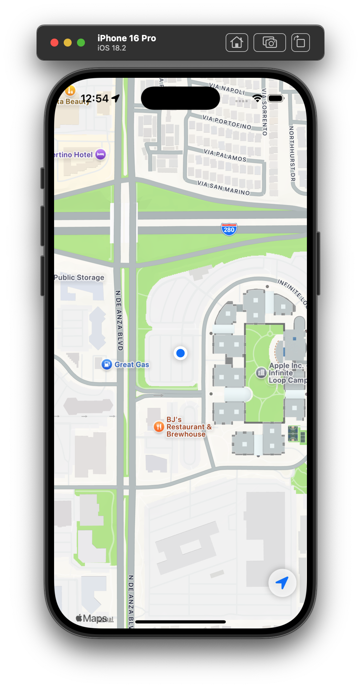

# SwiftUI MapKit Starter Template

This repository provides a handy starting point for building a SwiftUI app with MapKit features.

## Features

- **MapKit Integration:** Quickly set up maps and related features
- **Location Manager:** Manage user location 
- **Global Error Message Handler:** Capture and display errors consistently
- **Network Monitor:** Track connectivity changes automatically and alert the user

## Screenshot
Below is a screenshot of the app in "action" :)



*Screenshot: An example of the SwiftUI MapKit integration in action*

### Installation

1. **Clone the repository:**
   ```bash
   git clone https://github.com/karlok/MapKitTemplate.git
   
2. **Open the project in Xcode:**
    ```bash
    open MapKitTemplate.xcodeproj

3. Build and Run!

### Usage
-	Explore the code to see how MapKit, error handling, network monitoring, and location services are integrated
-	Customize the components to suit your project’s needs

### License
This project is licensed under the MIT License
